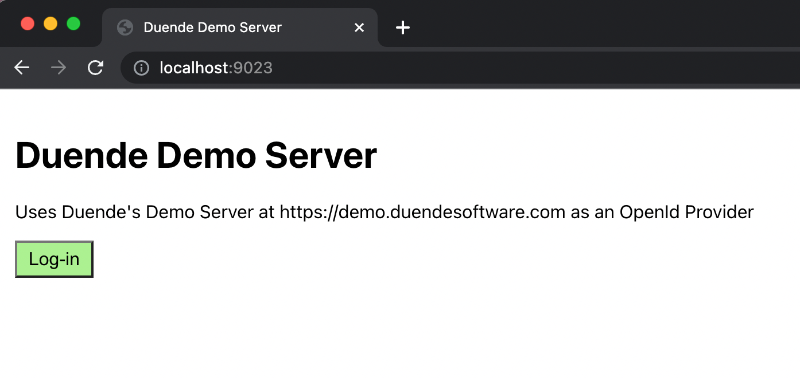
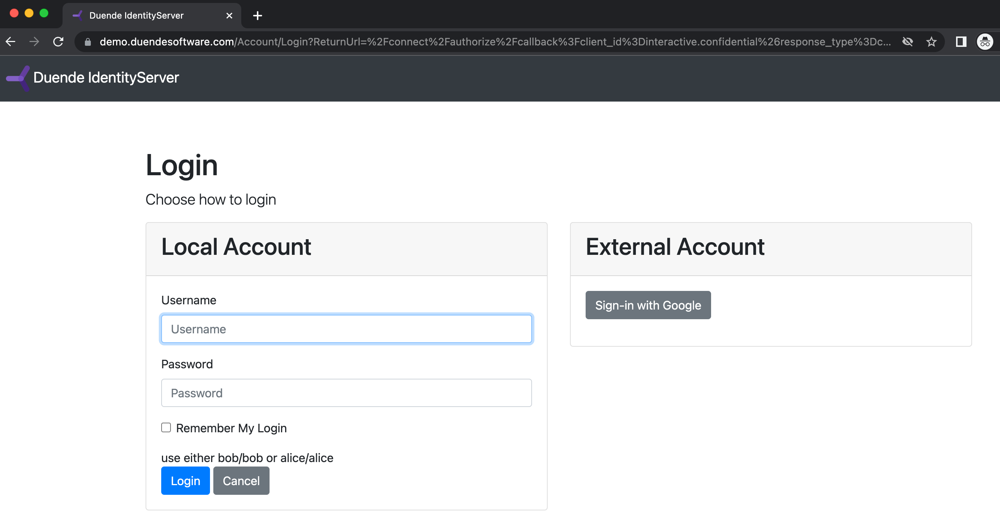
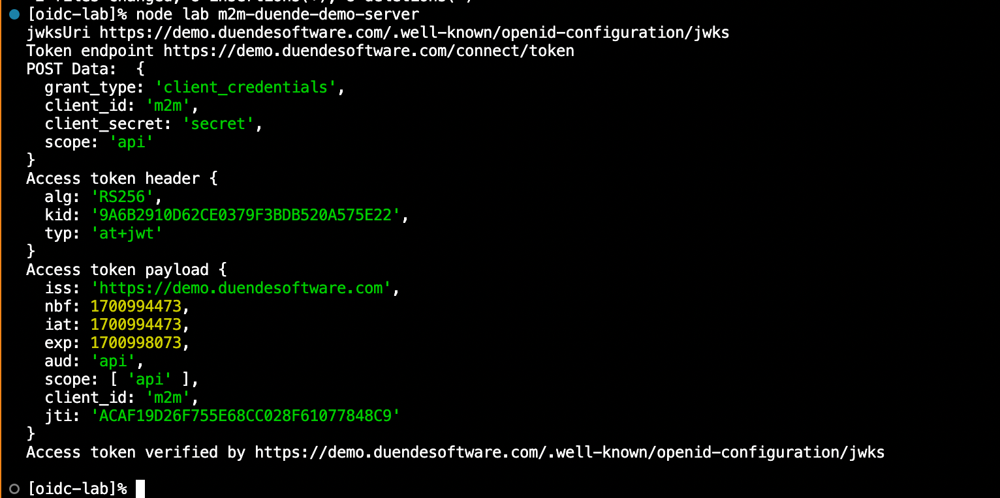

# OIDC Lab


OIDC-Lab is a configurable OAuth2 client which can be used to demonstrate and test [OAuth2 Authorization Servers and OpenId Providers](). 

**The code in this repo is for demonstration and testing purposes only it is not for production use.**

## System Requirements

- [Git](https://git-scm.com/downloads)
- [Node.js](https://nodejs.org/en)

Tested with Node v17, v18 and v19; it'll probably work with earlier versions too. 

## Install

```
git clone https://github.com/DavidPickles/oidc-lab.git
cd oidc-lab
npm install
```

## Configure and test

OIDC-Lab is a configurable OAuth2 client. Configuration files are .env files in sub-folders of the `configs` folder. You  manage your own configurations in `configs`, but two sample .env templates are provided to show how things work.  Both samples connect to [Duende's Public Demo Server](https://demo.duendesoftware.com/); one sample demonstrates OIDC Authorization Code Flow, the other demonstrates OAuth2 Client Credentials Flow. 

### 1. Configure

```
mkdir configs
```

Then copy the folders in `config-samples` to `configs`. 

```
cp -r config-samples/* configs
```

You now have two folders containing .env  files. 

```
configs/duende-demo-server
   .env
configs/m2m-deunde-demo-server
   .env
```

In general it's bad practice to store .env files in source control because they contain secrets. However Duende's public demo advertises its client secret; so in this case it really isn't secret at all. 


### 2.Authorization Code Flow

```
node lab "duende-demo-server"
```

Then point your browser at http://localhost:9023. You should see something like this:



Click Log-in and you'll be taken to the Duende public demo log-in page. 



The Duende log-in page tells you the username and passwords that are available. 

After you login, your page should look something like this:


### 4. Client Credentials Flow

```
node lab "m2m-duende-demo-server"
```

This gets a token and shows it on the console. There is no user interaction. The output should look like this:




## Cookies and Logout

Cookies are used by OPs to represent a user's logged-in state. 
The "Local Logout"  button is limited, it does not end a session with the OP. So even though it logs you out of OIDC-Lab it doesn't log you out of the OP.

When you're exploring OPs it can be hard to keep track of which users are logged in, so it can be useful to be able to just remove all potentially relevant cookies. For that reason it is generally a good idea to use private browsing or incognito mode, because you'll always start with no cookies set.

## Using your own configuration repo

You can use your own repo in the `configs` folder. However because .env files typically contain secrets they, must not be stored in the code repo. They are excluded by a .gitignore rule.

It is good practice to store the configurations as env.template files, with client and cookie secrets removed. 

## Hosts other than localhost

You might wish to run OIDC-Lab under a domain other than localhost. To do that means changing your local hosts file. 

On Windows, the hosts file is at:

```
C:\Windows\System32\drivers\etc\hosts
```

On a mac:

```
/etc/hosts
```

You need to add a line such as:

```
127.0.0.1     example1.internal
```

This will mean that OIDC-Lab can run on example1.internal. You'll need to change BASE_URL in the .env file to use this domain. 

## Reference for .env files

Note the use of IDP_BASE_URL, AUHTORIZE_PATH, and TOKEN_PATH are deprecated. ISSUER should be used instead. ISSUER will trigger the use of the [OIDC Well Known Discovery Document](https://oauth.net/2/authorization-server-metadata/).   
- Endpoints and other information such as public keys will be be obtained from the discovery document.
- The public keys will be used to verify the tokens returned by the OP.
- Not every OP provides a discovery document. For those servers which don't, continue to use IDP_BASE_URL with TOKEN_PATH and AUTHORIZE_PATH. 
- ISSUER and IDP_BASE_URL are exclusive. If you specify both you'll get an error. 
- If you use IDP_BASE_URL:
  - You must specify TOKEN_PATH (and AUTHORIZE_PATH if mode is oidc)
  - Token verification and potentially other features which rely on the discovery document won't be available.

Parameter | Opt/Req| Meaning
--|--|--
API_ENDPOINT-\<n> | Optional | API Endpoints that will be called with the access token as a bearer token.  Values of n can be 1-9.
APP_TITLE | Optional | Title that will appear on the oidc mode home page
AUTHORIZE_PATH | Required if IDP_BASE_URL and MODE is oidc| The path of authorization endpoint of the OP
BASE_URL | Required | The URL under which OIDC-Lab pages appear
CALL_BACK_PATH | Optional | By default the redirect_uri (OIDC callback) is `BASE_URL/oauth-callback`, but this parameter can be used to override it
CERTS_FOLDER | Optional | Default is `certs`
CLIENT_ID | Required | A client id registered on the OP
CLIENT_SECRET | Required if the registered client is confidential | The corresponding client secret
COOKIE_SECRET | Required | Used for encrypting local session cookies. The value of this isn't important unless you're thinking of exposing OIDC-Lab pages on the Internet (which is not recommended). 
HOME_PATH | Optional | By default the home URL of the app is BASE_URL, this parameter can override it
IDP_BASE_URL | Required if no ISSUER | Base URL of the OP
ISSUER | Required if no IDP_BASE_URL | The domain of the OIDC discovery document 
MODE | Required | oidc or m2m
SCOPE | Required | Scope parameter to the authorization request
SPIEL | Optional | A description that will appear on the OIDC mode home page
TOKEN_PATH | Required if IDP_BASE_URL | The path of the token endpoint of the OP

## HTTPS and OIDC-Lab

See [CERTIFICATES](./certs/CERTIFICATES.md)

