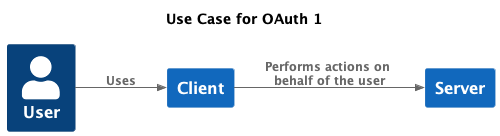
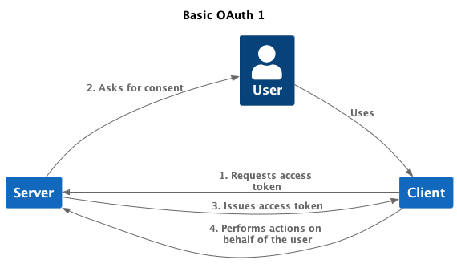
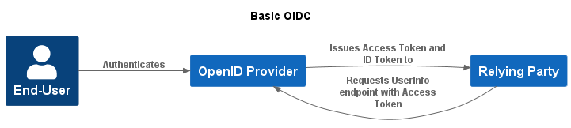
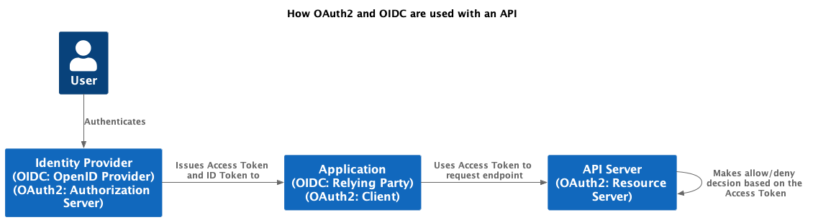
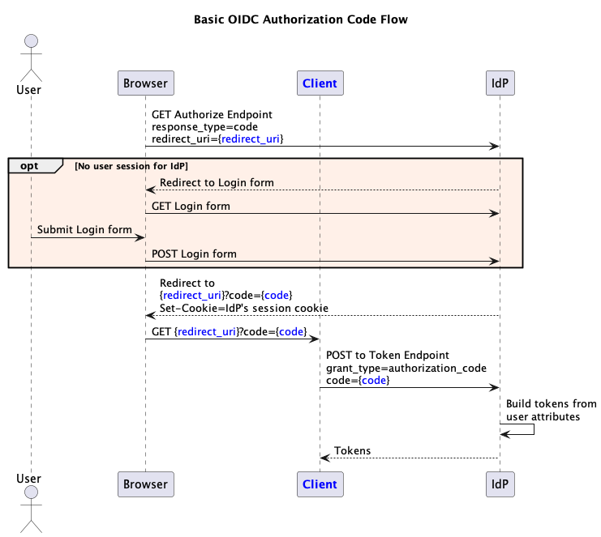
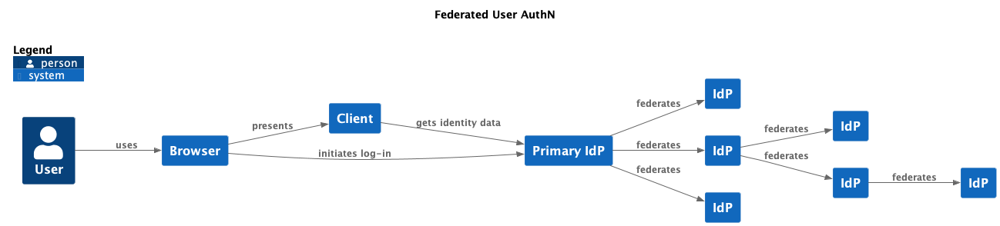

# **An Overview of OAuth and OIDC**
- [History: OAuth 1](#history-oauth-1)
- [OAuth 2.0](#oauth-20)
- [OIDC](#oidc)
- [Common Application Authorization Architecture Using OAuth 2 and OIDC](#common-application-authorization-architecture-using-oauth-2-and-oidc)
- [JWTs](#jwts)
- [Refresh Tokens](#refresh-tokens)
- [Grants and Flows: How to get access tokens](#grants-and-flows-how-to-get-access-tokens)
- [Public and confidential clients](#public-and-confidential-clients)
- [Client Registration](#client-registration)
- [Scopes](#scopes)
- [Federation](#federation)
- [OAuth 2.1](#oauth-21)
## History: OAuth 1
OAuth emerged from the need to allow a user to permit an application, referred to as the **client,** to call a service with precise limits controllable by the user on the scope of what the client is allowed to do. In this original use case, the client and server would typically be hosted on the web, and owned by separate organisations.

 

For example suppose the client renders email messages which it obtains from an email server. Without a protocol like OAuth, the way the client would get hold of your email messages would be to log-in to the email server as you. The most naive implementation of this would have the renderer client store your username and password. These are terrible ideas. 

OAuth’s trick was to provide a framework for allowing a client like the renderer to register with the server, then require the client to get an access token from the server, a process which includes a step that asks the user for consent to allowing this client to perform certain actions on the server - for example “Can I read emails please?”

 

OAuth still sometimes has this consent function, but today it is involved in other use cases as well.

## OAuth 2.0
OAuth 2.0 simplified and extended the original framework. One important clarification was to distinguish two logical components: one that *issues* tokens, called the **authorization server**, and the other that *uses* the tokens called the **resource server** (in our example, the email server).

 

- An **Access Token** is a string issued to the **Client** by an **Authorization Server (AS).**
- The client makes a request to the **Resource Server (RS)** to perform an action on a resource, and includes the access token in the request. Typically a resource server has RESTful API endpoints, so the resources are what’s named by those endpoints.
- The resource server validates the access token, and if it is valid it allows the action requested; otherwise the action is denied.

## OIDC
OIDC is an extension to OAuth 2.0 which provided two things. A framework for getting identity information about a user. And a confusing parallel terminology. 

- **OpenId Provider (OP)** is a an authorization server which has some means for authenticating the identity of an end user, for example by asking for the user to a provide username and password. The means of authentication are outside the OIDC specification.
- **Relying Party (RP)** is an OAuth 2 client. I’ll generally use the word ‘Client’ instead.
- **ID Token** is a kind of token specific to OIDC. It is a JSON Web Token - JWT - (see next section), which is issued to the RP by the OP at the same time as an access token, and holds information about the authenticated user.
- **UserInfo endpoint** An alternative or supplement to using an ID Token, it is a resource provided by the OP which returns information about an authenticated end-user, normally in JSON form. The request for the resource must be accompanied by the access token obtained when the user authenticated.

What’s the difference between an ID Token and Access Token? An ID Token is issued to the client and the claims in it are intended to be read by the client. An Access Token is issued to the client , but any data it represents is NOT intended to be read by the client. The Access Token is intended to be passed to a Resource Server when client requests a resource from it, and is used by the Resource Server to make an allow/deny decision.

 

The OP is behaving both as Authorization Server, and as Resource Server for the UserInfo endpoint.

Another term used a great deal in this context, is **Identity Provider** or **IdP** (or IDP). This is more generic than *OpenID Provide*r and includes systems that establish identity using different protocols. For example a SAML system performs authentication, and so is referred to as an IdP. So all OpenID Providers are IdPs, but not all IdPs are OpenID Providers. 
## Common Application Authorization Architecture Using OAuth 2 and OIDC
Here’s a model of a modern application which combines OAuth 2/OIDC to call an API. I’ve indicated the parallel terminologies for the components:

 

Where the client application and server are both owned by the same organisation, the consent step that was a part of the original OAuth use case is dropped. In these cases either the resources are owned by the organisation, or consent has been granted in advance, for example when the user or customer provided data to the organisation. 

The final step, where the API server makes an allow/deny decision based on the access token, is the cornerstone of authorisation based on OAuth 2. But step this can only happen if data on which the decision is based is provided in the access token. So responsibility for authorisation is shared in this architecture between the component issuing the access token and the component using the token to make the allow/deny decision; in OAuth 2 terms, between the Authorization Server and the Resource Server, and in OIDC terms, between the OpenID Provider and the Resource Server. 

(A more complex architecture for authorization includes another component, sometimes called a *policy information point*. This allows the resource server to look-up ancillary data to aid its decision, based on claims in the access token.)

The Client does very little for authorization. It obtains an access token and it passes it on to the server in the request to the server. (Though a fairly common alternative architecture is where there is no API, and the application acts both in the role of client AND as resource server.)

The access token is normally passed to the server as a [bearer token](https://datatracker.ietf.org/doc/html/rfc6750), which just means it appears in the request Authorization header after the word ‘Bearer’.
## JWTs
Signed JSON Web Tokens, JWTs, are a generic means of communicating information in a way that can be trusted. They contain a JSON payload and a signature. The signature is used to ensure that the data originates from a trusted source, one that holds the private key or secret used to create the signature. The RFC allows for unsigned JWTs but that is generally considered to be a mistake, so I’ll always mean a signed JWT when I use that term. (See [RFC ft-ietf-oauth-json-web-token: JSON Web Token (JWT)](https://datatracker.ietf.org/doc/html/rfc7519) and <https://jwt.io/>.)

Each key/value pair in the JSON payload of a JWT is known as a **claim**.

The OIDC standard mandates that ID tokens are JWTs, and allows access tokens to be JWTs. An alternative to an access token being a JWT is that it is an **opaque** or **reference** token, a random and unique string. As the allow/deny decision made by the resource server is typically based on information about the user, if an opaque token is issued the resource server will call the UserInfo endpoint to obtain that data (or an I[ntrospection Endpoint](https://www.oauth.com/oauth2-servers/token-introspection-endpoint/)). 

There are pros and cons to using opaque tokens, but as this scenario makes clear, it typically requires a call to UserInfo or the Introspection Endpoint, which can otherwise be avoided. 

## Refresh Tokens
Access tokens are normally quite short lived, typically from 15 to 30 minutes. Access tokens are passed in every request from client to resource server; if an access token is stolen, a short life provides a shorter window of opportunity for an attacker to exploit. It also means that if access rights are withdrawn from the user, it’ll take no longer than the lifespan of an access token for the change to take effect and the user be blocked from actions.

So short lived access tokens are a good idea, but It is not practicable to ask a user to repeatedly re-authenticate. Instead an authorization server can issue a refresh token along with an access token. A refresh token is much longer-lived than an access token. At the time that the access token expires (or just before), the client uses the refresh token to request a new one. 

## Grants and Flows: How to get access tokens
OAuth 2.0 defines several ways of obtaining access tokens. The overall interactions between client, authorization server, and, in some cases, user, are called **authorization flows**. 

Every authorization flow includes a step called a **grant** where the client calls the authorization server token endpoint with credentials of some kind. Credentials are confidential pieces of information, and are the basis for issuing tokens, though what kind of credentials are needed depends on the grant in question. OAuth 2.0 defines several types of grant, but many are now deprecated. The most important remaining grants are:

|**Grant Type**|**Description of Flow**|**Credentials used to make the token request**|
| :-: | :-: | :-: |
|**Client Credentials**|<p>No user is involved. The flow is sometimes referred to as ‘machine to machine' or ‘server to server’. </p><p>The ‘flow’ is a single request to the Authorization Server token endpoint. </p>|<p>A client id (which identifies the system to which the token is to be issued) and, in the simplest case, a client secret. </p><p>An alternative to a client secret is a signed JWT. This can be convenient in order to avoid having to pass secrets around (the client only has to give the Authorization Server its public key).</p>|
|**Authorization Code**|For all cases in which a user is to be authenticated. It typically includes the user entering a username and password into a browser form, though other kinds of user identification are consistent with the OAuth 2 and OIDC standards.|<p>After the user has proven his or her identity, for example by giving a valid password, a very short lived ‘authorization code’ is issued via a browser redirect. </p><p>This code is one of the credentials in the token request.</p><p>Depending on the type of client involved, the token request may also include a client id and client secret (or signed JWT).</p>|
|**Refresh Token**|<p>Used to obtain a new access token from the Authorization Server. </p><p>The ‘flow’ is a single request to the token endpoint.</p>|<p>The refresh token is one of the credentials in the token request. </p><p>Depending on the type of client involved, the token request may also include a client id and client secret (or signed JWT).</p>|

Here is an example of a token request in the client credentials flow :

```
curl --request POST \
    --url "$TOKEN\_ENDPOINT" \
    --header 'content-type: application/x-www-form-urlencoded' \
    --data grant\_type=client\_credentials \
    --data "client\_id=$CLIENT\_ID" \
    --data "client\_secret=$CLIENT\_SECRET"
```

Authorization Code Grant is more complicated because it involves an intervening code used as credential in the grant step. It involves two endpoints defined by OAuth 2, the Authorize Endpoint (typically /authorize) and the token endpoint (typically /token). Here is an example in which a user identifies themselves by providing a password:

 

The diagram above doesn’t show all the necessary parameters, for example it doesn’t show the client ids or any secrets being passed, but does show the parameters essential to understanding the flow. 

In this example after a user has logged-in, the IdP sets a session cookie on the browser. This is not required by the OAuth 2 or OIDC standards, but is a very common device used by IdPs. If the cookie is set, when the browser calls the authorization endpoint, the user will not have to log-in again. 
## Public and confidential clients
The various grants described in the previous section rely on credentials being provided to the token endpoint to identify and authenticate the client and, where a user is involved, the user. The types of credentials are:

- For a client: a Client Secret or Signed JWT
- For a user: a temporary authorization code
- For refreshing an access token: a refresh token

Different types of clients differ on their ability to store data securely. Once upon a time it was relatively clear what kind of application fell into which category. Server side web applications were considered confidential because they can securely store client secrets, private keys, or refresh tokens. Other types of applications were considered public, and these included single page JavaScript applications executing in the browser (SPAs), and native apps, neither of these, so the story went, could securely store credentials. 

These categories are still useful, but browsers have become increasingly secure, and there are techniques which make things more nuanced (see [The OAuth 2.1 Authorization Framework | Client Types](https://datatracker.ietf.org/doc/html/draft-ietf-oauth-v2-1-08#section-2.1))

- Server-side web applications are still the paradigm type of confidential client. They can securely store client credentials and refresh tokens.
- SPAs are public with regard to client credentials unless they have a Backend For Frontend (BFF). The BFF executes server-side; it stores the client credentials, and makes the token request. Without a BFF there are techniques for using refresh tokens in a secure way. This includes having shorter lifespans for refresh tokens, invalidating the tokens on use, and making the tokens ‘sender constrained’ using [DPoP](https://datatracker.ietf.org/doc/html/draft-ietf-oauth-dpop-11) (Demonstrating Proof of Possession).
- For native apps, you can’t store credentials in code downloaded from a store. However the BFF pattern can be used for native apps. And, in addition to this, Dynamic Client Registration can be used to register the native app and create credentials for it, once it is installed on a device (See <https://curity.io/resources/learn/openid-connect-understanding-dcr/> ). For refresh tokens the same techniques as described for SPAs are available. 
## Client Registration
OAuth 2 and OIDC needs the AS to know about the client. For confidential clients the AS and client needs to share information about credentials. And the AS needs to know what kind of grants to allow for the client. For those clients which will use authorization code flow, the AS needs to know what counts as a valid redirect URI. There’s quite a lot of other information that it’s necessary to store against clients, but this is the core. 

The [Dynamic Client Registration Protocol](https://datatracker.ietf.org/doc/html/rfc7591) is a standard for automating registration. 
## Scopes
Scopes are space-separated values that are parameters to the authorize and token endpoints of an AS, and they may also appear in the access token it creates.

In OAuth as it was originally conceived, scopes ensured that users are in control of the operations carried out on their behalf by an application. They represented the actions for which the user would be asked to consent. For example an email client application might cause the AS to ask: “Will you let this application get your email messages from your email provider’s API?”. The answer is then included in the claims represented by the access token. All this could be achieved by the request to the AS specifying a scope ‘read:email’, and if the user consents, the access token containing the same scope. 

OIDC kept and subtly extended this idea. One use of scopes in OIDC is simply to inform the IdP that the client application wants to use the OIDC protocol. It does this by including 'openid' as a scope value. For example an OIDC authorize request scope might look like this:

scope=openid email roles

The first scope is there to trigger the OIDC protocol.What about the other scopes in this example? The OIDC spec [Final: OpenID Connect Core 1.0 incorporating errata set 1](https://openid.net/specs/openid-connect-core-1_0.html#ScopeClaims) says:

For OpenID Connect, scopes can be used to request that specific sets of information be made available as Claim Values.

This is referring to clam values that appear in the ID Token and/or UserInfo. The standard defines four optional, standard scopes: profile, email, address, phone. Each is defined to result in specific claims. For instance email scope means that the email and email\_verified claims will be returned. So in the example above: scope=openid email roles, openid says that the request is for OIDC authentication, email is a standard scope asking for email and email\_verified claims. And roles could be a request for a set of claims relevant to roles, but it has no standard semantics.

In an application authorization architecture using OAuth 2 and OIDC, scopes are commonly used for representing authorization data independently of any concern with user consent. For example, scopes can represent potential user actions, and their appearance or otherwise in an access token may represent permission to perform that action. But that’s not necessarily a good pattern, and matters can quickly become over-complicated when there's a need to protect multiple APIs in variety of contexts. This brings us to some important questions about authorization, but these will be covered elsewhere. 
## Federation
A feature of OIDC is that one IdP can act as a client for another, creating a possibly complex tree of identity providers.

 

Where one IdP acts as a client to another, the first is said to **federate*** to the second. And a **Home Realm Discovery** logic must exist to make choices between IdPs. For example in some cases a given client might be taken to a specific upstream IdP. In other cases, the user has to be asked to choose. 

In a related sense, the word *federation* is also sometimes used to describe a configuration in which a client offers one or more external IdPs to potential users, for example where a client offers GitHub and Google. 

The diagram below shows federation from one IdP to another, where the primary IdP, which the original client knows about, acts in the role of client to the secondary IdP. For simplicity not all the parameters needed are shown.

 

This diagram shows the sequence in the case where the secondary IdP is an OpenID Provider. But there are variants. For example, the secondary IdP might support an alternative authentication protocol such as SAML, and so the primary IdP would be a SAML client of the secondary one. 

## OAuth 2.1
OAuth 2 and OIDC are evolving in the sense that over the last decade a set of best-practices and complementary standards have emerged. These are now being consolidated into [OAuth 2.1](https://oauth.net/2.1/). 

The major differences from OAuth 2.0 are:

- **PKCE must always be used with Authorization Code Flow.** PKCE ensures that the token request originates from the same source as the authentication request. It adds parameters to the auhtorization and token request parameters. The authorization request includes a hash of a temporary, cryptographically-random secret created by the client, called a code-verifier. The authorization server remembers the code-verifier.The token request contains the secret in plain text. On receipt of the token request, the authorization server checks that the hash of the secret matches the code-verifier.
- **Redirect URIs must be compared using exact string matching.** In the absence any restrictions on redirect URI for a client, an attacker could obtain an authorzation code by providing their own redirect uri. Allowing wildcards in the URI can be convenient, but leaves open loopholes, which this best-practice closes.
- **Several grant types are omitted from OAuth 2.1.** I already mentioned that the recommended grant types has narrowed over the last few years; OAuth 2.1 omits the Implicit grant, and the Password grant. 
- **Bearer token usage omits the use of bearer tokens in the query string of URIs.** Query strings are exposed to JavaScript, server log files, caches, or browser history.
- **Refresh tokens for public clients must either be sender-constrained or one-time use.** 
- **The definitions of public and confidential clients have been simplified to only refer to whether the client has credentials.** The previous definitions were less clear cut.
---
David Pickles
